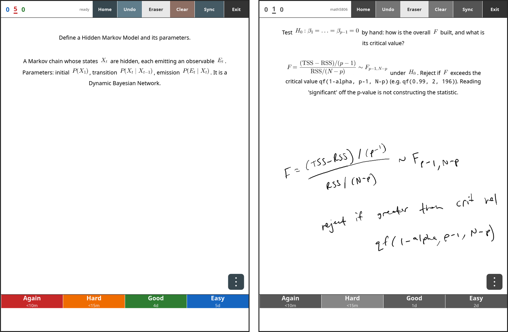

# ankimarkable

A native **Anki review client for the reMarkable Paper Pro** — Anki's real Rust
backend (`rslib`), genuine AnkiWeb sync, full HTML/CSS card rendering, LaTeX math,
and an AnkiDroid-style **pen whiteboard** so you write your answer before revealing
it. Ships as a standalone [AppLoad](https://github.com/asivery/rm-appload) app: no
xochitl injection, no boot-bank risk.

<p align="center">
  
</p>

*Left: a card with inline LaTeX rendered on-device, in **colour mode** (note the
coloured grade bar). Right: the same app in **black-and-white mode** — tap the
deck counts (top-left) to switch; the whole frame desaturates, which many people
prefer for text-heavy decks on e-ink — with an answer being worked out by hand
on the pen whiteboard before revealing.*

## Features

- **Real Anki, not a viewer** — the actual `rslib` backend: a true `.anki2`
  collection, the FSRS scheduler with per-grade interval previews, and genuine
  **AnkiWeb sync** (incremental + automatic full-download recovery, media included).
- **Pen whiteboard over every card** — low-latency A2-waveform inking with the
  marker, pressure-sensitive width, working **eraser end**, stroke undo, and palm
  rejection. Ink persists through Show Answer so you can compare, and clears on grade.
- **LaTeX / MathJax math** — `\(...\)`, `\[...\]` and `[latex]` blocks render
  on-device via a bundled MicroTeX helper: fractions, big operators, `\perp`,
  `\stackrel`, `\boldsymbol`, blackboard/calligraphic letters. Inline math is
  baseline-aligned with the text; display math renders at natural size. TikZ
  diagrams appear via Anki desktop's own pre-rendered SVGs.
- **Full card fidelity** — cards render with their own HTML/CSS templates (pure-Rust
  blitz/stylo stack, embedded fonts), including images from your media collection.
- **Two-finger scroll + pinch-zoom** — long cards pan with a two-finger drag
  (fast partial refreshes while you move, one clean colour pass when you stop;
  your ink scrolls with the card). Pinch snaps between 1.0×/1.25×/1.5×/2.0× with
  a real reflow — text gets bigger *and rewraps to the card width*, so nothing
  hangs off-screen. One finger on the card still does nothing (palm safety).
- **Home screen** — collapsible deck tree with due counts, review streak, and
  tap-to-review any deck.
- **Colour ↔ black-and-white toggle** — tap the deck counts (top-left) to flip
  the whole frame between full colour and desaturated grayscale. Colour is great
  for image-heavy decks; B&W renders text crisper on e-ink and avoids the colour
  panel's slower settle. The mode persists as you review and is unmissable when
  toggled (the grade bar changes with it — see the screenshots above).
- **Review chrome** — new/learning/review counts with an underline marking the
  current card's queue; Undo (strokes first, then the last grade); an overflow menu
  for **bury card / suspend note**; colour-e-ink-aware refresh (fast mono inking +
  debounced colour settle, no flashing).
- **Safe by construction** — an external AppLoad process talking to the QTFB
  framebuffer. It cannot crash-loop xochitl or flip your boot bank.

## Install (device: reMarkable Paper Pro)

1. Install [xovi](https://github.com/asivery/xovi) + [rm-appload](https://github.com/asivery/rm-appload) (free, one-time).
2. Copy the app folder to `/home/root/xovi/exthome/appload/anki/`
   (`ankimarkable`, `icon.png`, `external.manifest.json`).
3. Copy `mathpng` to `/home/root/.ankimarkable/bin/mathpng` and the `microtex-res/`
   folder to `/home/root/.ankimarkable/microtex-res/` (math support).
4. Put your AnkiWeb credentials in `/home/root/.ankimarkable/ankiweb.txt`
   (line 1: email, line 2: password), launch from the AppLoad menu, tap **Sync**.

## Build (cross-compile from a Mac/Linux host)

```sh
export PROTOC="$(command -v protoc)"          # protobuf compiler for anki's build
cargo zigbuild --target aarch64-unknown-linux-musl --release
```

The math helper (`tools/mathpng/`) builds against
[MicroTeX](https://github.com/NanoMichael/MicroTeX) with Qt6 in an aarch64 SDK
container — see `tools/mathpng/mathpng-build.sh`.

## Environment knobs

| Variable | Default | Meaning |
|---|---|---|
| `ANKIMARKABLE_COL` | `/home/root/.ankimarkable/collection.anki2` | collection path |
| `ANKIMARKABLE_DECK` | `uni` | initial deck scope |
| `AM_MATHPNG` | `/home/root/.ankimarkable/bin/mathpng` | math helper binary |
| `AM_MATHPNG_RES` | `/home/root/.ankimarkable/microtex-res` | MicroTeX res fonts |

## License

**AGPL-3.0** (see `LICENSE`) — required by the [Anki](https://github.com/ankitects/anki)
`rslib` backend this links. Vendored `vendor/rex` is MIT/Apache-2.0;
`tools/mathpng` builds against MIT-licensed MicroTeX; bundled fonts are OFL/MIT.

A ready-made binary bundle is sold at
[bazaar.abaj.ai](https://bazaar.abaj.ai/remarkable) — buying it funds development;
building from this source yourself is and will always be possible.
